# Reading and Interpreting Statistical Chart
on this project i tried to extract accurate statical information from Bar and Pie chart images using MATLAB.
Given an image that contains a statistical chart and the color of each category (i.e. legend), the program extracts statistical information in a textual from and plot it back on the source image.

## Functions Structure
<p align='center'>
	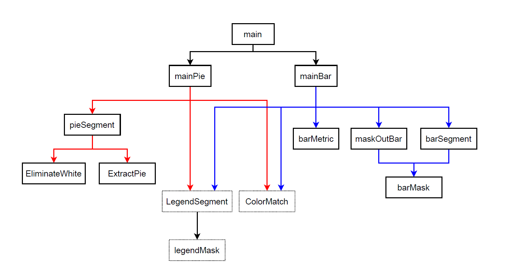
</p>
this diagram shows the used functions, functions are pictured by blocks, arrows are descriping which lower functions are used by upper functions.

**legendMask**: this function takes RGB image and returns a binary mask of the legend part.
<p align='center'>
	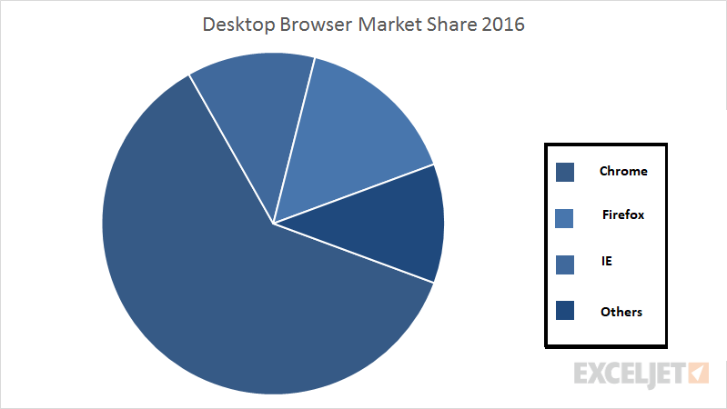
	
</p>

**LegendSegment**: this function takes RGB image and uses a binary mask of the legend part and returnes the legend colors, titles insinde the legend and bounding boxes for the titles of the legend part.

**ExtractPie**: this function takes RGB image i and mask out the pie shape from the image.
<p align='center'>
	
	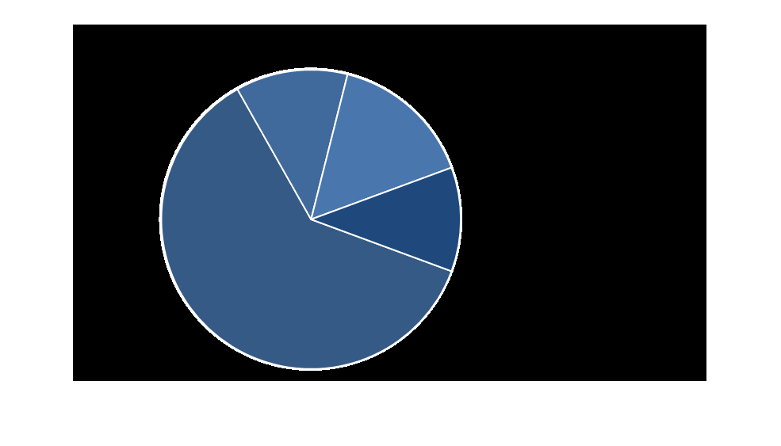
</p>

**EliminateWhite**: this function takes a masked out pie shape and changes the bright pixels value to black.
<p align='center'>
	
	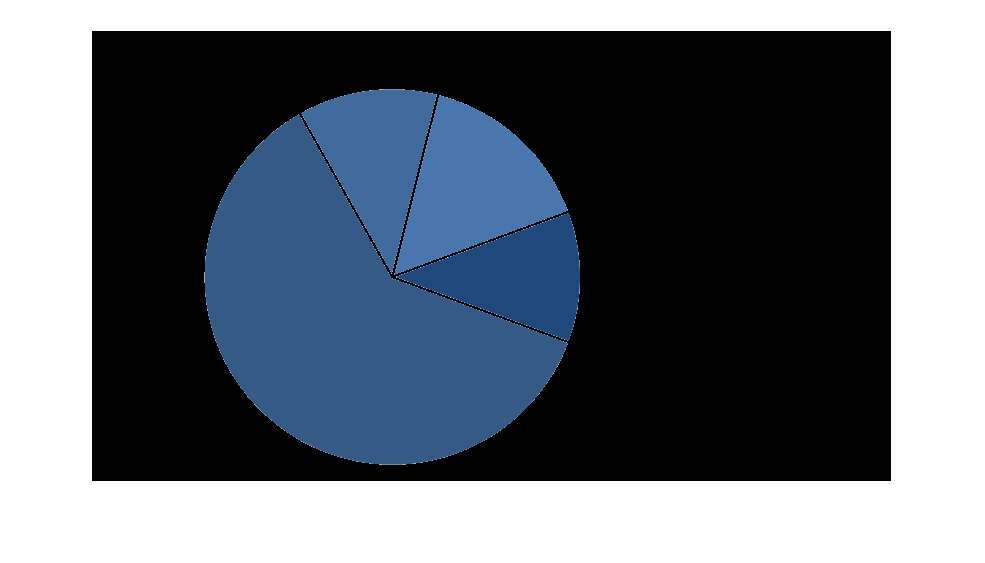
</p>

**pieSegment**: this function takes RGB image and mask out the pie shape using ExtractPie & EliminateWhite functions and then creates a binary mask from the masked out pie shape and returns the color and percentage of each component in the pie shape respectively.

**barMask**: this function takes RGB image and returns a binary mask of the bars.
<p align='center'>
	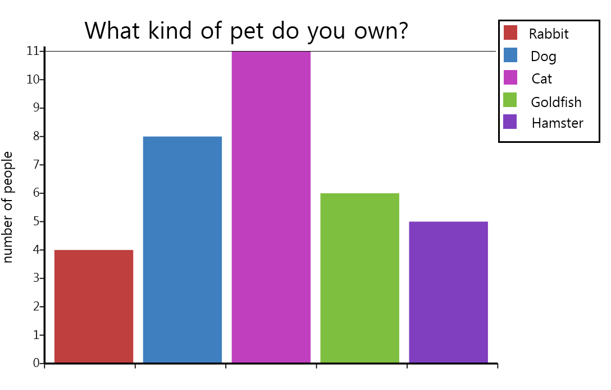
	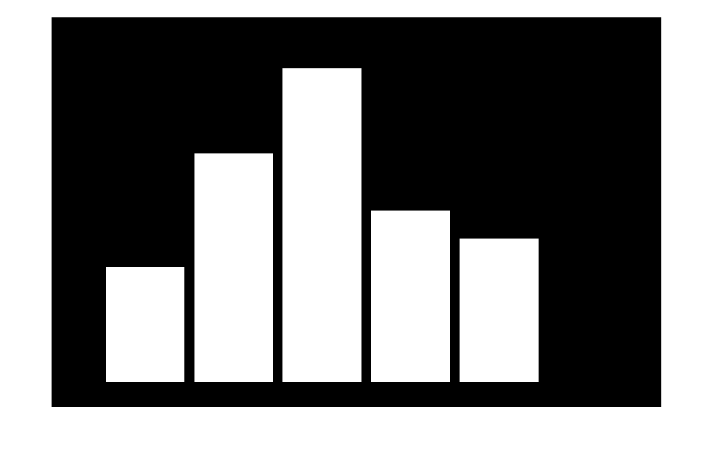
</p>

**maskOutBar**: this function takes RGB image and returnes the input image but the bar shapes are replaced with white color (essential to detect the legend).
<p align='center'>
	
	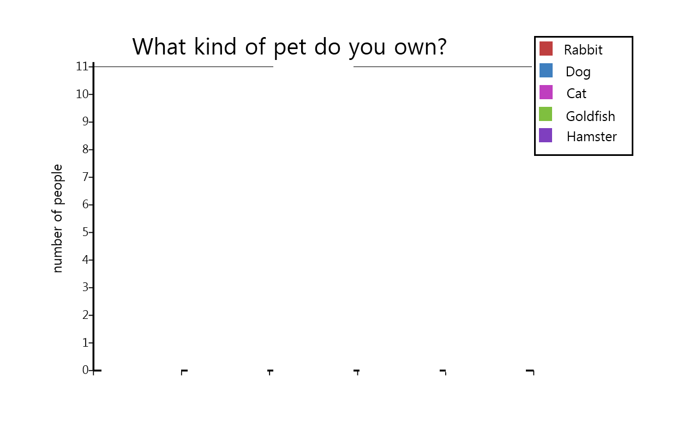
</p>

**barSegment**: this function takes RGB image and returns the colors ond bounding boxes of the bar shapes.

**barMetric**: this function takes RGB image and returns a bounding box of max number in the vertical axis and Y coordinate of max number.
<p align='center'>
	
	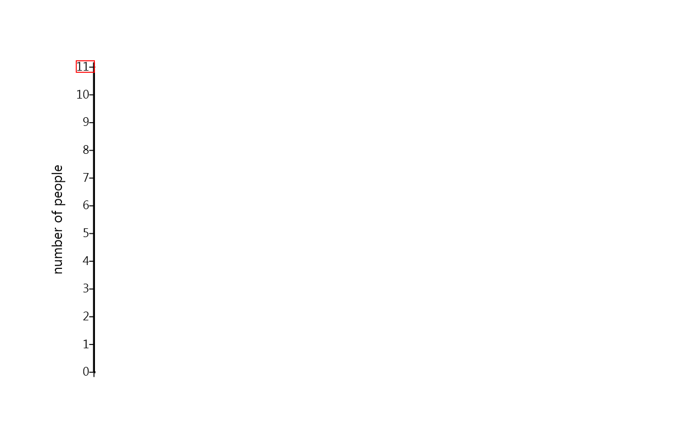
</p>

**ColorMatch**: this function takes two list of colors, c1 -> bar chart or pie chart colors, c2 -> colors extracted from the legend, the function returns a new list c2indexs behaves like a pointer, for example if c2indexs(i)=j so c1(i) match with c2(j).

**mainPie**: this function takes RGB image and gets the colors & percentage of pie shape and colors & titles of the legend and links each prcentege with it's title using the colors, also it draws a bounding boxes around titles defining each title percentage.

**mainBar**: this function takes RGB image and gets the colors & bounding boxes of bar shape and colors & titles of the legend and calculating the prcentege of each bar shape with respect to the max number and links each prcentege with it's title using the colors, also it draws a bounding boxes around titles defining each title percentage and bounding box around the max number.

**main**: this function is the main entry to the program, takes an image and the photo type in string format 'pie' for pie chart and 'bar' for bar chart.

## Run and Output
to run the program simply use main function and pass the photo with it's type.
for example:
```sh
main(imread('TestCases/C1_1.png'), 'pie')
```
in case of pie chart the output percentage is a percentage of each component to the whole pie shape, in case of bar chart the output percentage is a percentage of each component to the max number in the vertical axis.
<p align='center'>
	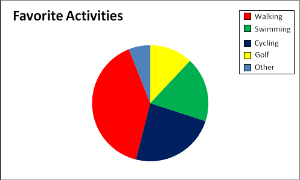
	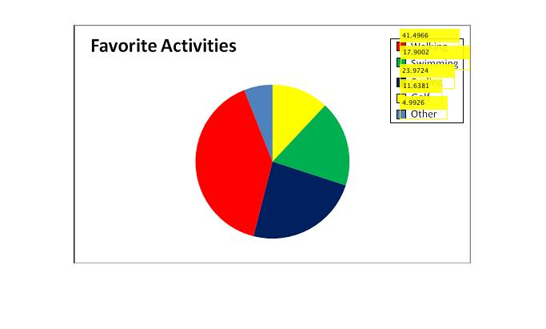
</p>
<p align='center'>
	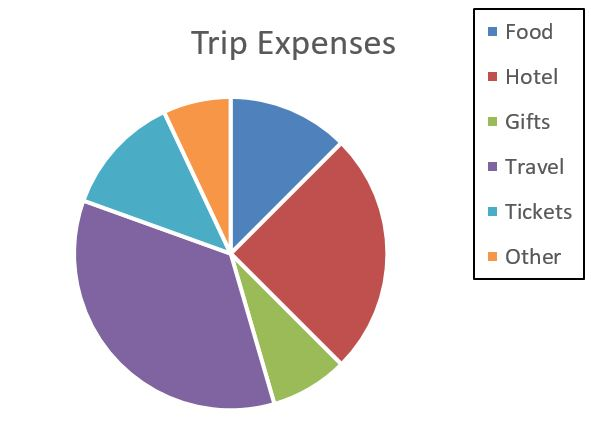
	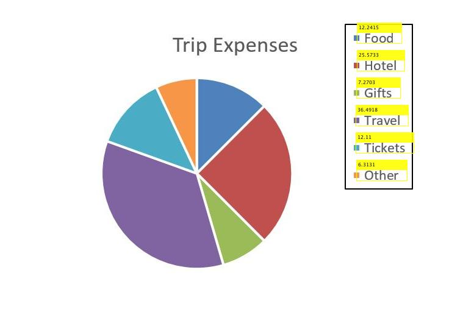
</p>
<p align='center'>
	
	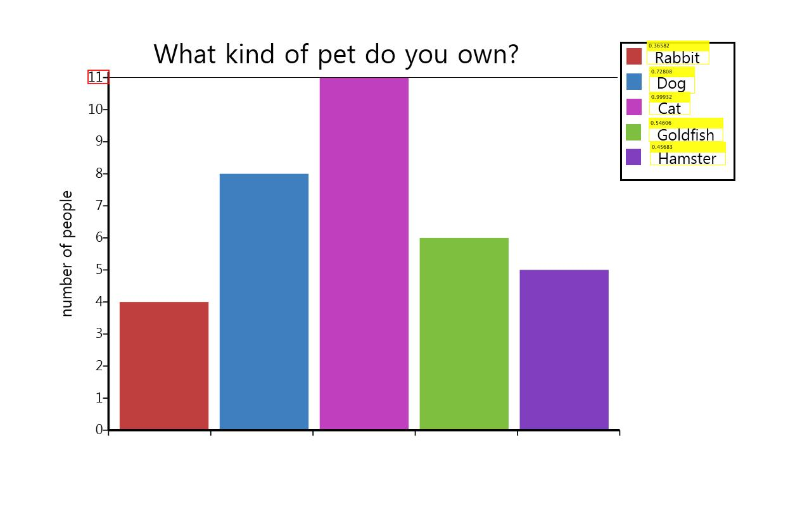
</p>
<p align='center'>
	
	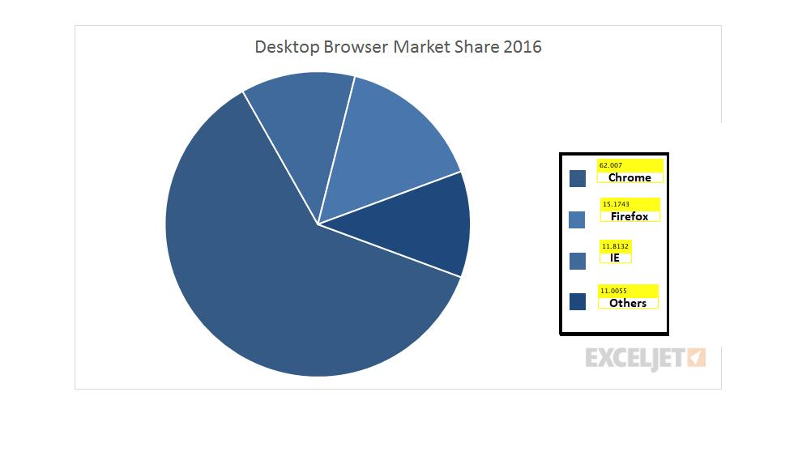
</p>
<p align='center'>
	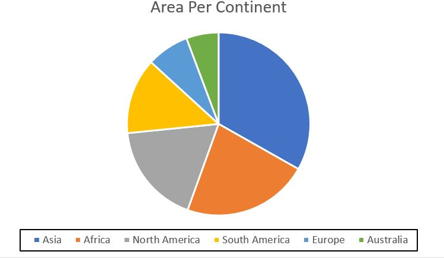
	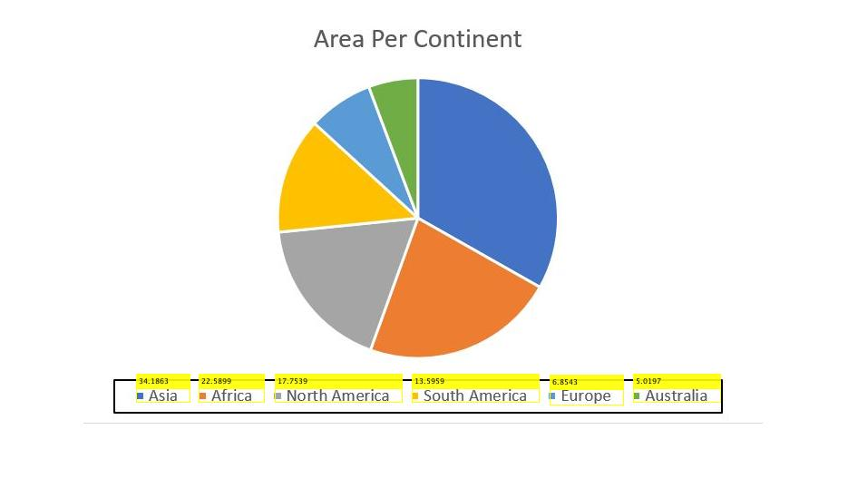
</p>
<p align='center'>
	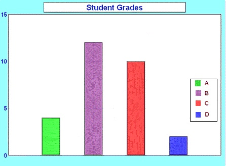
	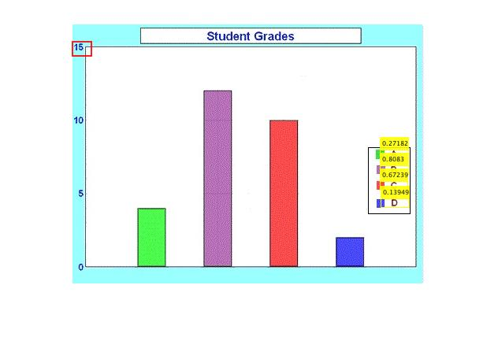
</p>
<p align='center'>
	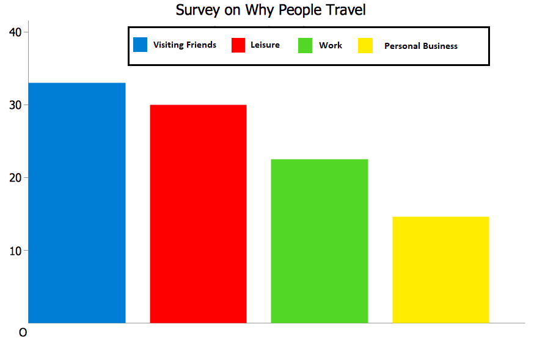
	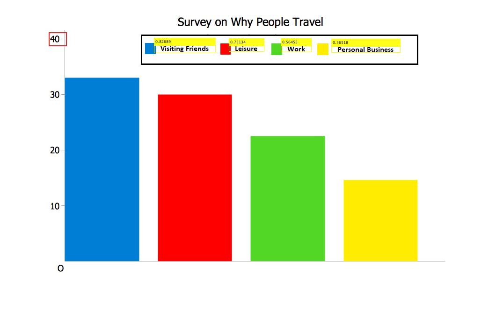
</p>